# Drywall Tools

## Johnny Bungay & Colin Kennedy

#### Wall Board Lifter

Worn on the foot and used to lift and hold a drywall sheet for nailing.

####Hand Sander

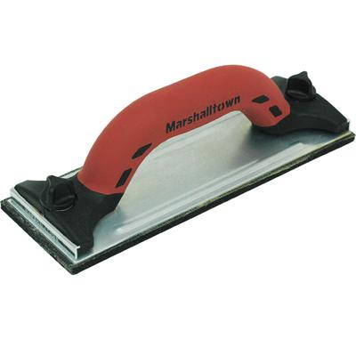

Used to smooth plaster that was applied to a join.

####Drywall Saw

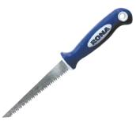

Used to cut drywall. Has a pointed tip so that it can be used to pierce drywall.

####Stud Finder

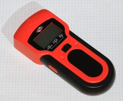

Used to locate the wooden studs behind drywall. Useful when attaching something heavy to the wall.

####Drywall Square

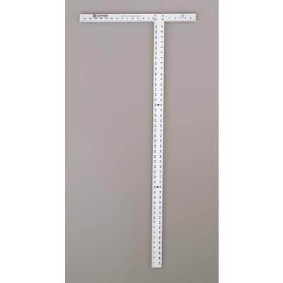

A large square used to mark and cut drywall sheets.

####Drywall Corner Tool

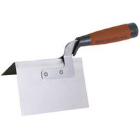

An angled trowel for smoothing plaster at a corner join.

####Plaster Hawk

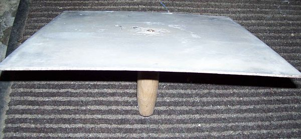

Used to hold plaster in one hand so that the other can apply it with a trowel. Similar to an artist's palette.

####Pole Sander

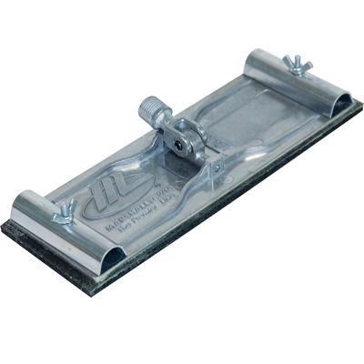

A sand-paper vehicle which can connect to a broom handle. Enables sanding of ceilings or high walls.

####Drywall Hammer

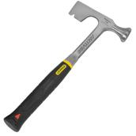

A lightweight hammer with a hatchet tail suitable for quickly breaking one-by pieces of wood that are frequently needed to provide backing for patch jobs. The tail is also used to support and carry a sheet of drywall.

####Outside Corner Tool

Used to smooth plaster on an outside corner.

####Utility Knife

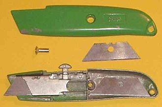

A general purpose knife. Used in plastering to score to score and crack drywall.

####Taping Knives

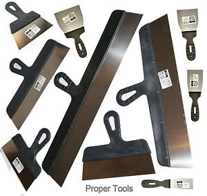

A wide blade used to spread and plaster.

####Putty Knife

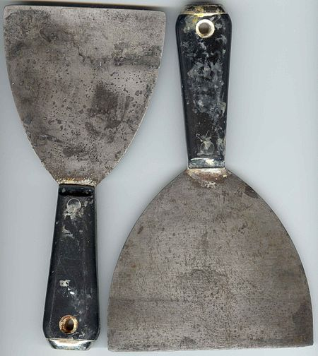

A smaller blade used to spread and smooth plaster.

####Finishing Knife

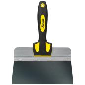

Used to apply and feather drywall compound.

####Plastering Trowels

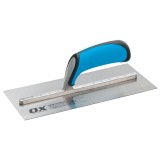

Used to spread plaster.
